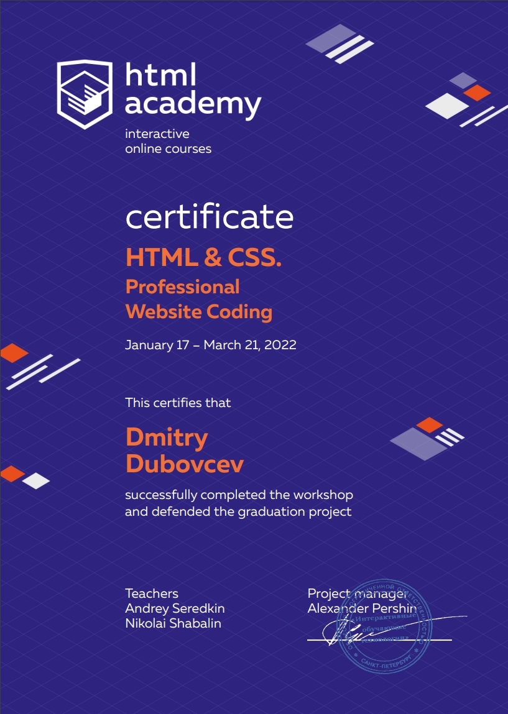
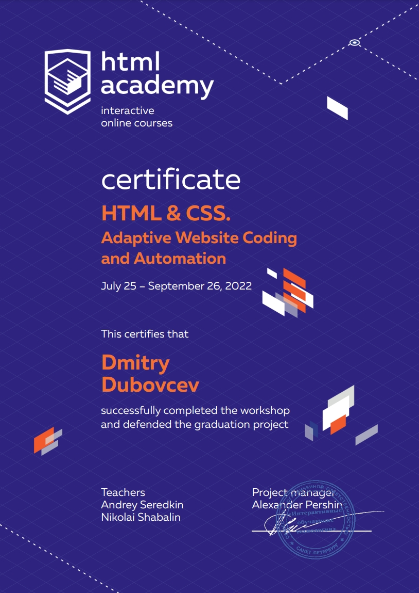
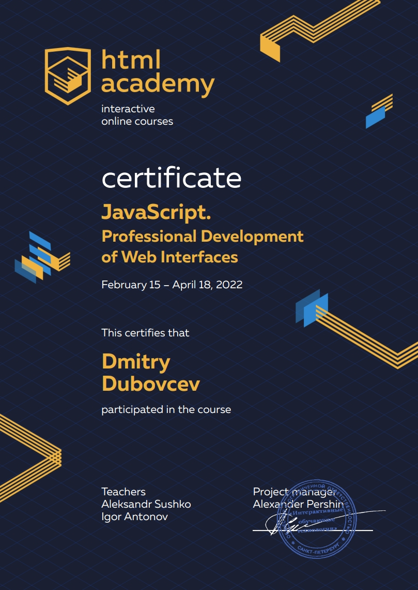
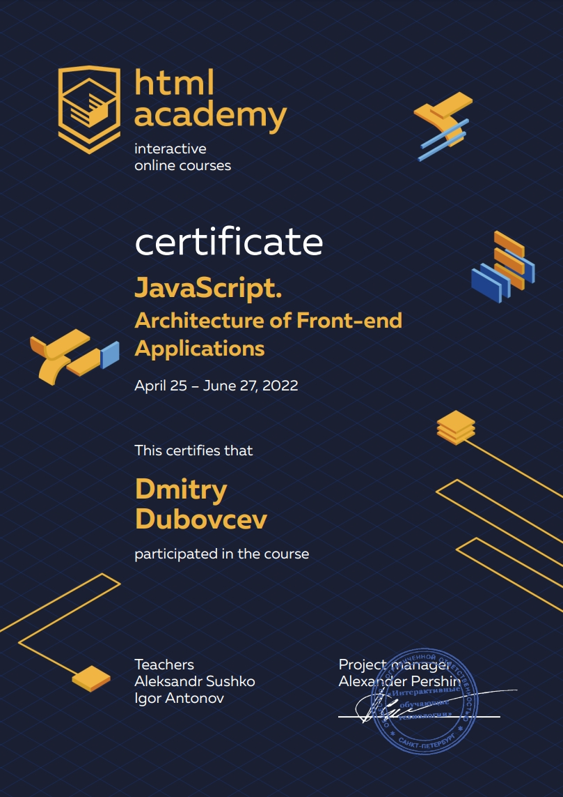

sd[rsschool-cv]("Ссылка на визитку")

# **Dmitry Dubovcev**
## **Contact Info**


#### **Phone:** +7 (977) 516-81-61  
#### **E-mail:** dubovcevdm@mail.ru
#### **Telegram:** [@DubovcevDm](https://t.me/dubovcevdm "DubovcevDm")


## **About Me**

I worked as a screenwriter and editing director for a long time, but realized that I enjoyed solving a different type of problems, which led me to find myself in frontend development. I have a full set of soft skills and love learning, constantly developing, and can`t sleep until a task is solved. My main goal is to become an excellent frontend developer who can bring big profits to an employer with my solutions.

## **Skills**

* HTML5
* CSS3 *(SASS/SCSS, BEM)*
* JavaScript *(Basic)*
* Adaptive layout *(mobile /desktop first)*
* Git / Webpack /Gulp / Node *(Basic)*
* Pixel Perfect / Figma

## **Code Example**

```
function descendingOrder(n) { 
	return n=parseInt((n.toString().split('').sort((a, b) => b-a)).join(''));
}
```

## **Experience**

#### ***My learning projects on GitHub:***
* [Smart Device](https://u1timad.github.io/smart_device/build/ "They smart but not like you")
* [Antarctic\`s cruice](https://u1timad.github.io/antarctic/public/ "Cruise to Antarctic")
* [City of Sedona](https://u1timad.github.io/931167-sedona-26/build/ "Come to our city")


### **Education**

* **University:** Moscow Polytechnic University formerly called "MAMI" Moscow State Technical University. The specialty "Innovatics" 
* **Courses:** [HTML ACADEMY](https://htmlacademy.ru "HTML_ACADEMY")

	* HTML и CSS. Professional Website Coding 
	* HTML и CSS. Adaptive Website Coding and Automation
	* JavaScript. Professional Development of Web Interfaces
	* JavaScript. Architecture of Front-end Applications

   

## **Languages**

* **Russian** - native speaker.
* **English** - A2 


# [rsschool-cv](https://GITHUB-USERNAME.github.io/rsschool-cv/cv "My CV")


	2023-03-29
	CV#1. Markdown & Git

1. Task: https://github.com/rolling-scopes-school/tasks/blob/master/tasks/cv/git-markdown.md
2. Screenshot:
   
3. Deploy: https://u1timad.github.io/rsschool-cv/cv
4. Done 10.03.2023 / deadline 29.03.2023
5. Score: 100 / 100
- Вёрстка, дизайн, UI (15/30)
  - [x] минимальная ширина страницы, при которой она отображается корректно – 320 рх (10)
  - [±] внешний вид приложения внешне соответствует макету или является его улучшенной версией (5/10)   
  - [ ] приложение корректно отображается для любого выбранного языка (0)
- В блоке "Погода за сегодня" отображаются следующие данные (15/20)
  - [x] данные о погоде и местоположении пользователя (10)
  - [±] часы, обновляющие время каждую секунду (5/10) 
